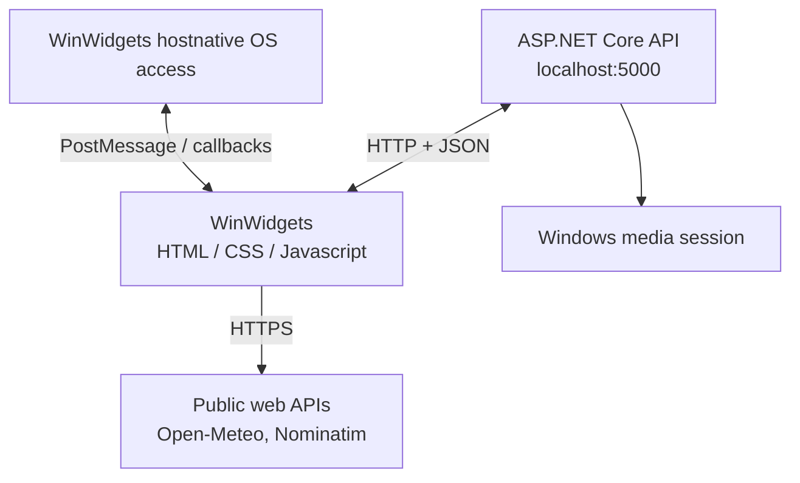

# Deskly
Desktop widgets for Windows, built with HTML, CSS and JavaScript, and backed by a C# ASP.NET Core API.

    

# Overview
Deskly is a collection of small, good-looking widgets that sit on top of your Windows desktop and show useful information at a glance: the weather, what's playing, the time around the world, system load, and more.

Every widget is a plain web page (HTML, CSS and JavaScript) that is rendered as a desktop widget by the WinWidgets host application. Anything a web page can't do on its own, such as reading the currently playing song from Windows or storing a picture on disk, is handled by a lightweight ASP.NET Core API that runs locally on your machine.

# Widgets

| Widget | File | What it does | Data comes from |
| -------- | -------- | -------- | -------- |
| Weather | `weather.html` | Feels-like temperature, conditions, humidity, rain chance and wind for your location. The icon changes with the weather and day/night. Refreshes every 10 minutes, or on demand. | Browser geolocation, OpenStreetMap Nominatim, Open-Meteo |
| Music Player | `MusicPlayer.html` | Shows the title, artist and artwork of whatever is playing, with play/pause, next and previous controls. | Backend API (Windows media session) and the host |
| Calendar | `Calender.html` | Month view with previous/next navigation and today highlighted. | JavaScript |
| World Clock | `WorldClock.html` | Local time and date plus four other time zones, each with its offset and a day/night icon. | JavaScript (`Intl`) |
| Calculator | `Calculator.html` | A compact four-operation calculator with history. | Host |
| CPU | `CPU.html` | Current CPU load as a percentage, updated every 2 seconds. | Host |
| GPU | `RAM.html` | Physical memory usage as a percentage, updated every 2 seconds. | Host |
| RAM | `Power-Battery.html` | Battery level, with an icon that reflects the charge level and charging state. | Browser Battery Status API |
| Image Viewer | `SmallImageViewer.html`, `LargeImageViewer.html` | Pin a picture to your desktop. Hold Ctrl and click the image to choose a new one. The picture is remembered between sessions. | Backend API |

# How it works



1. **Widgets** (`FrontEnd/`) Each widget is one HTML file with its own script, and all of them share a single stylesheet. A few `<meta>` tags at the top of each page tell the host how to present it:
```html
<meta name="applicationTitle" content="CPU Widget"/>
<meta name="windowSize" content="130 120"/>
<meta name="windowBorderRadius" content="30"/>
```

2. **The host (WinWidgets)** WinWidgets turns those pages into borderless desktop windows. It also gives widgets access to things a browser sandbox can't reach. A widget asks for something with `window.chrome.webview.postMessage(...)`, and the host answers by calling a function in the page:

| Message sent by the widget | Used by | Host reply |
| -------- | -------- | -------- |
| `GetCpuLoad` | CPU | Calls `GetCpuLoad(percentage)` |
| `GetMemoryInfo` | RAM | Calls `GetMemoryInfo(memInfo)` with used and total physical/virtual memory |
| `GetCurrentKeyPressed` | Image viewers | Calls `GetCurrentKeyPressed(keyCode)`, used to detect the Ctrl key |
| `ToggleMediaPlayback`, NextMediaTrack, PreviousMediaTrack | Music Player | Controls system media playback |

3. **The backend** (`Backend/`) An ASP.NET Core Web API (.NET 9) handles the jobs that need real system access:

- **Music**: reads the current song, artist, playback state and artwork from the Windows media session (the same source that powers the volume flyout).
- **Images**: stores the picture chosen in each image viewer in a local `SavedFiles` folder and serves it back when the widget starts.

CORS is enabled so the widget pages can call the API from their own origin.

# API reference

Base URL: http://localhost:5000

| Method | Endpoint | Description |
| -------- | -------- | -------- |
| `GET` | `/MusicPlayer/GetSongInfo` | Current song info (`id`, `name`, `artist`, `status`) |
| `GET` | `/MusicPlayer/GetThumbnail` | Artwork of the current song (`image/jpeg`) |
| `POST` | `/ImageViewer/files` | Upload the large viewer image (multipart field `file`) |
| `GET` | `/ImageViewer/thumbnail` | Get the saved large viewer image |
| `POST` | `/SmallImageViewer/files` | Upload the small viewer image (multipart field `file`) |
| `GET` | `/SmallImageViewer/thumbnail` | Get the saved small viewer image |
