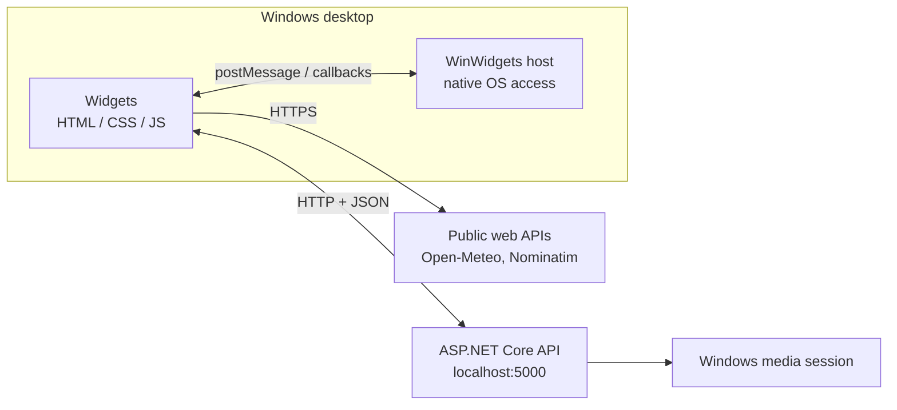

# Deskly

**Desktop widgets for Windows, built with HTML, CSS and JavaScript, and backed by a C# ASP.NET Core API.**


---

## Overview

Deskly is a collection of small, good-looking widgets that sit on top of your Windows desktop and show useful information at a glance: the weather, what's playing, the time around the world, system load, and more.

Every widget is a plain web page (HTML, CSS and JavaScript) that is rendered as a desktop widget by the [WinWidgets](https://github.com/beyluta/WinWidgets) host application. Anything a web page can't do on its own, such as reading the currently playing song from Windows or storing a picture on disk, is handled by a lightweight **ASP.NET Core API** that runs locally on your machine.

## Widgets

| Widget | File | What it does | Data comes from |
| --- | --- | --- | --- |
| **Weather** | `Weather.html` | Feels-like temperature, conditions, humidity, rain chance and wind for your location. The icon changes with the weather and day/night. Refreshes every 10 minutes, or on demand. | Browser geolocation, OpenStreetMap Nominatim, Open-Meteo |
| **Music Player** | `MusicPlayer.html` | Shows the title, artist and artwork of whatever is playing, with play/pause, next and previous controls. | Backend API (Windows media session) and the host |
| **Calendar** | `Calender.html` | Month view with previous/next navigation and today highlighted. | JavaScript |
| **World Clock** | `WorldClock.html` | Local time and date plus four other time zones, each with its offset and a day/night icon. | JavaScript (`Intl`) |
| **Calculator** | `Calculator.html` | A compact four-operation calculator with history. | JavaScript |
| **CPU** | `CPU.html` | Current CPU load as a percentage, updated every 2 seconds. | Host |
| **RAM** | `RAM.html` | Physical memory usage as a percentage, updated every 2 seconds. | Host |
| **Battery** | `Power-Battery.html` | Battery level, with an icon that reflects the charge level and charging state. | Browser Battery Status API |
| **Image Viewer (small / large)** | `SmallImageViewer.html`, `LargeImageViewer.html` | Pin a picture to your desktop. Hold **Ctrl** and click the image to choose a new one. The picture is remembered between sessions. | Backend API |

## How it works

The project is made of three cooperating layers:



**1. Widgets (`FrontEnd/`)**
Each widget is one HTML file with its own script, and all of them share a single stylesheet. A few `<meta>` tags at the top of each page tell the host how to present it:

```html
<meta name="applicationTitle" content="CPU Widget"/>
<meta name="windowSize" content="130 120"/>
<meta name="windowBorderRadius" content="30"/>
```

**2. The host (WinWidgets)**
WinWidgets turns those pages into borderless desktop windows. It also gives widgets access to things a browser sandbox can't reach. A widget asks for something with `window.chrome.webview.postMessage(...)`, and the host answers by calling a function in the page:

| Message sent by the widget | Used by | Host reply |
| --- | --- | --- |
| `GetCpuLoad` | CPU | Calls `GetCpuLoad(percentage)` |
| `GetMemoryInfo` | RAM | Calls `GetMemoryInfo(memInfo)` with used and total physical/virtual memory |
| `GetCurrentKeyPressed` | Image viewers | Calls `GetCurrentKeyPressed(keyCode)`, used to detect the Ctrl key |
| `ToggleMediaPlayback`, `NextMediaTrack`, `PreviousMediaTrack` | Music Player | Controls system media playback |

**3. The backend (`Backend/`)**
An ASP.NET Core Web API (.NET 9) handles the jobs that need real system access:

- **Music**: reads the current song, artist, playback state and artwork from the Windows media session (the same source that powers the volume flyout).
- **Images**: stores the picture chosen in each image viewer in a local `SavedFiles` folder and serves it back when the widget starts.

CORS is enabled so the widget pages can call the API from their own origin.

## API reference

Base URL: `http://localhost:5000`

| Method | Endpoint | Description |
| --- | --- | --- |
| `GET` | `/MusicPlayer/GetSongInfo` | Current song info (`id`, `name`, `artist`, `status`) |
| `GET` | `/MusicPlayer/GetThumbnail` | Artwork of the current song (`image/jpeg`) |
| `POST` | `/ImageViewer/files` | Upload the large viewer image (multipart field `file`) |
| `GET` | `/ImageViewer/thumbnail` | Get the saved large viewer image |
| `POST` | `/SmallImageViewer/files` | Upload the small viewer image (multipart field `file`) |
| `GET` | `/SmallImageViewer/thumbnail` | Get the saved small viewer image |

Example:

```http
GET http://localhost:5000/MusicPlayer/GetSongInfo
```

```json
{
  "id": "Spotify.exe",
  "name": "Song Title",
  "artist": "Artist Name",
  "status": "Playing"
}
```

Uploading an image from the command line:

```bash
curl -F "file=@photo.jpg" http://localhost:5000/ImageViewer/files
```

## Getting started

### Prerequisites

- Windows 10 (build 19041) or Windows 11
- [.NET 9 SDK](https://dotnet.microsoft.com/download)
- [WinWidgets](https://github.com/beyluta/WinWidgets)
- An internet connection (fonts, icons and weather data are loaded online)

### 1. Start the API

```bash
cd Backend/ProjectNexusAPI/ProjectNexusAPI
dotnet run --urls "http://localhost:5000"
```

> The widgets expect the API at `http://localhost:5000`. If you prefer another port, update the URLs in the scripts inside `FrontEnd/Scripts/`.

### 2. Load the widgets

Add the widget files from `FrontEnd/` to WinWidgets, following the WinWidgets documentation, and enable the ones you want.

<!--
  Optional: add exact WinWidgets steps here (folder location, how to enable a widget)
  so readers can get going without leaving this page.
-->

The Weather, Calendar, World Clock, Calculator, CPU, RAM and Battery widgets work on their own. Only the **Music Player** and **Image Viewer** widgets need the API to be running.

## Customizing

### Change the look of every widget

All colors live in three variables at the top of `FrontEnd/Styles/styles.css`. The lighter and darker shades are derived from them automatically.

```css
:root {
  --MainColor: #1F5192;
  --TitleColor: #FBF1F0;
  --DescriptionColor: #D06DB7;
}
```

### Change the World Clock cities

Edit the list of time zones in `FrontEnd/Scripts/WorldClockScript.js`:

```js
const Timezones = ['Asia/Riyadh', 'Europe/London', 'Asia/Tokyo', 'America/New_York'];
```

### Build your own widget

A widget that needs system data follows the same simple pattern the CPU widget uses: ask the host, then handle the reply.

```js
// The host calls this function with the answer
function GetCpuLoad(percentage) {
    document.getElementById("CPU-Usage").innerText = Math.round(percentage);
}

// Ask the host now, then every 2 seconds
window.chrome.webview.postMessage('GetCpuLoad');
setInterval(() => window.chrome.webview.postMessage('GetCpuLoad'), 2000);
```

A widget that needs the backend simply calls the API:

```js
const song = await fetch("http://localhost:5000/MusicPlayer/GetSongInfo").then(r => r.json());
```

## Project structure

```
Project/
├── Backend/
│   └── ProjectNexusAPI/
│       ├── ProjectNexusAPI.sln
│       └── ProjectNexusAPI/
│           ├── Controllers/      # MusicPlayer, ImageViewer, SmallImageViewer
│           ├── Models/           # SongInfo
│           ├── Program.cs        # App setup, CORS, routing
│           └── ProjectNexusAPI.csproj
└── FrontEnd/
    ├── *.html                    # One page per widget
    ├── Scripts/                  # One script per widget
    └── Styles/
        └── styles.css            # Shared theme and layout
```

## Notes

- The project is Windows-only, because the music widget uses Windows media APIs.
- The API is meant to run locally, alongside the widgets.
- Images chosen in the viewers are saved in a `SavedFiles` folder next to the running API.

## Made by hand

**This project was built without AI and without vibe coding.** Every line of HTML, CSS, JavaScript and C# in this repository was written by hand, and every design and architecture decision was made by a person.

## Credits

- [WinWidgets](https://github.com/beyluta/WinWidgets) for hosting the widgets on the desktop
- [Open-Meteo](https://open-meteo.com/) for weather data
- [OpenStreetMap Nominatim](https://nominatim.org/) for reverse geocoding
- [Font Awesome](https://fontawesome.com/) for icons
- [Google Fonts](https://fonts.google.com/) for the Huninn typeface

## License

<!-- Choose a license and add a LICENSE file, then update this line. -->
Released under the **MIT** license. See `LICENSE` for details.

---

<sub>Built by [Eyad  Hossni]([https://github.com/YOUR-USERNAME](https://github.com/EyadHossni))</sub>
